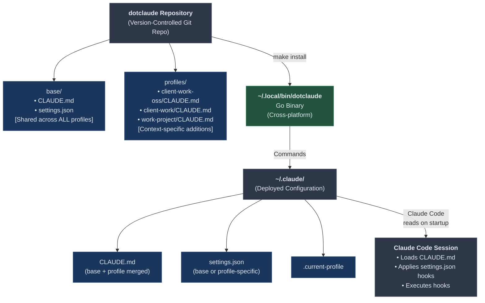
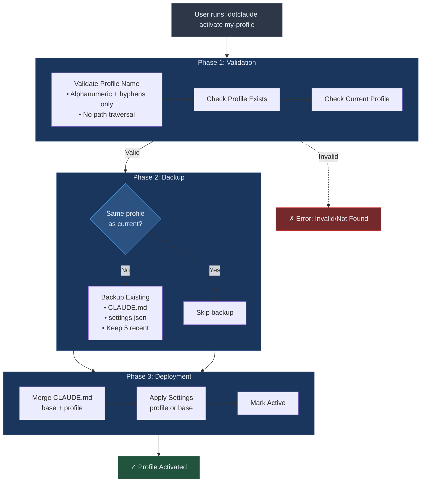
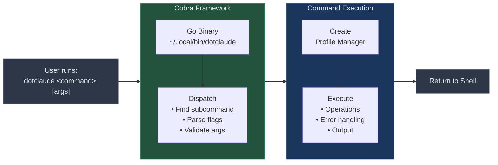
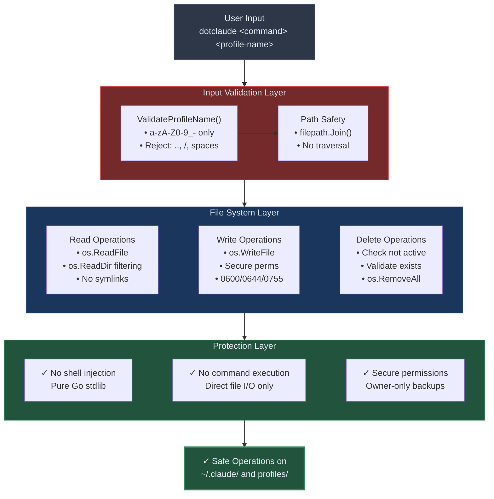
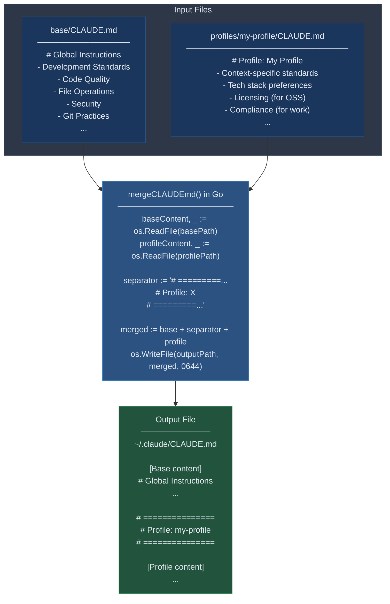

# dotclaude Architecture

Technical overview of how dotclaude works internally.

> **Note**: dotclaude v1.0.0-rc.1+ is a pure Go implementation that runs natively on Linux, macOS, and Windows. The legacy shell implementation has been archived to `archive/` for reference only.

## System Architecture



## Go Implementation Architecture

dotclaude v1.0.0 is implemented in Go using the [Cobra](https://github.com/spf13/cobra) CLI framework.

### Package Structure

```
dotclaude/
├── cmd/dotclaude/
│   └── main.go              # Entry point
├── internal/
│   ├── cli/                 # Cobra command implementations
│   │   ├── root.go          # Root command, global flags, config
│   │   ├── version.go       # version command
│   │   ├── list.go          # list/ls command
│   │   ├── show.go          # show command
│   │   ├── create.go        # create/new command
│   │   ├── delete.go        # delete/rm command
│   │   ├── edit.go          # edit command (cross-platform editor)
│   │   ├── activate.go      # activate/use command
│   │   ├── switch.go        # switch/select command
│   │   ├── restore.go       # restore command
│   │   ├── diff.go          # diff command
│   │   ├── check_branches.go # check-branches command
│   │   ├── sync.go          # sync command
│   │   ├── hook.go          # hook run/list/init commands
│   │   ├── terminal.go      # Cross-platform color support
│   │   ├── terminal_unix.go # Unix terminal handling
│   │   └── terminal_windows.go # Windows ANSI VT support
│   ├── hooks/               # Hook system
│   │   ├── hooks.go         # Hook runner, priority ordering
│   │   └── builtins.go      # Built-in hook implementations
│   └── profile/             # Business logic
│       ├── profile.go       # Manager, Profile types, validation
│       ├── create.go        # Profile creation with git init
│       ├── delete.go        # Safe profile deletion
│       ├── activate.go      # Profile activation with merge
│       └── restore.go       # Backup restoration
├── go.mod                   # Go module definition
├── go.sum                   # Dependency checksums
└── Makefile                 # Build targets
```

### Key Types

```go
// Profile represents a dotclaude profile
type Profile struct {
    Name         string
    Path         string
    IsActive     bool
    LastModified time.Time
}

// Manager handles profile operations
type Manager struct {
    RepoDir     string  // dotclaude repository location
    ProfilesDir string  // RepoDir/profiles
    ClaudeDir   string  // ~/.claude
    StateFile   string  // ~/.claude/.current-profile
}

// Backup represents a backup file
type Backup struct {
    Path      string
    Filename  string
    Timestamp string
    Size      int64
    Type      string  // "CLAUDE.md" or "settings.json"
}
```

## Profile Activation Flow



## CLI Command Flow



## Security Architecture



## Data Flow: Profile Merge



## Implementation Notes

As of v1.0.0-rc.1, dotclaude is a pure Go implementation with no shell dependencies.

**Historical:** The migration from shell to Go used the Strangler Fig pattern. See [SHELL-TO-GO-MIGRATION.md](SHELL-TO-GO-MIGRATION.md) for details on this migration strategy.

## Commands Reference

| Command | Aliases | Description | Flags |
|---------|---------|-------------|-------|
| `version` | - | Show version | - |
| `list` | `ls` | List all profiles | `--verbose` |
| `show` | - | Show active profile | `--debug` |
| `create` | `new` | Create new profile | `--verbose` |
| `delete` | `rm`, `remove` | Delete profile | `--force` |
| `edit` | - | Edit profile in $EDITOR (uses active if no name) | `--settings` |
| `activate` | `use` | Activate profile | `--dry-run`, `--preview`, `--verbose`, `--debug` |
| `switch` | `select` | Interactive profile selector | - |
| `restore` | - | Restore from backup | - |
| `diff` | - | Compare profiles | `--verbose` |
| `check-branches` | `branches`, `br` | Check branch status | `--base` |
| `sync` | - | Sync with main | `--base` |
| `hook run` | - | Execute hooks of a type | - |
| `hook list` | - | List available hooks | - |
| `hook init` | - | Initialize hooks directory | - |

## File System Layout

```
dotclaude/                              # Repository (version controlled)
├── README.md                           # Quick start guide
├── install.sh                          # Installer
├── Makefile                            # Build targets
├── go.mod                              # Go module
├── go.sum                              # Dependencies
├── cmd/dotclaude/
│   └── main.go                         # Go entry point
├── internal/
│   ├── cli/                            # Command implementations
│   ├── hooks/                          # Hook system
│   └── profile/                        # Profile business logic
├── bin/
│   └── dotclaude                       # Compiled Go binary
├── base/                               # Shared base configuration
│   ├── CLAUDE.md                       # Base development standards
│   ├── settings.json                   # Base hooks & settings
│   ├── hooks/                          # Hook scripts
│   └── agents/                         # Shared agents
├── archive/                            # Archived shell implementation
│   ├── dotclaude-shell                 # Legacy shell CLI
│   └── README.md                       # Rollback instructions
├── profiles/                           # Context-specific profiles
│   ├── my-project/
│   │   └── CLAUDE.md
│   └── work-project/
│       └── CLAUDE.md
├── examples/
│   └── sample-profile/                 # Template for new profiles
└── tests/
    ├── commands.bats                   # Legacy BATS tests
    ├── security.bats                   # Security tests
    └── integration.bats                # Integration tests

~/.local/bin/
└── dotclaude                           # Installed Go binary

~/.claude/                              # Deployed configuration
├── .current-profile                    # Active profile name
├── CLAUDE.md                           # Merged: base + profile
├── CLAUDE.md.backup.*                  # Up to 5 recent backups
├── settings.json                       # Active settings
└── settings.json.backup.*              # Up to 5 recent backups
```

## Build System

### Makefile Targets

```bash
make build    # Build bin/dotclaude
make test     # Run Go tests
make clean    # Remove bin/
make install  # Install to ~/.local/bin
```

### Dependencies

- **Go 1.23+** - Build requirement
- **github.com/spf13/cobra v1.10.2** - CLI framework

## Testing

### Go Tests (Primary)

```bash
go test ./...                  # All Go tests
go test ./... -cover           # With coverage
go test ./internal/profile/... # Specific package
```

### BATS Tests (Legacy)

The project includes 114+ legacy BATS tests for the archived shell implementation:

| Suite | Count | Description |
|-------|-------|-------------|
| `commands.bats` | 50 | All CLI commands and flags |
| `security.bats` | 40 | Input validation, path safety |
| `integration.bats` | 24 | End-to-end workflows |

```bash
bats tests/                    # All BATS tests
bats tests/commands.bats       # Command tests only
```

## Environment Variables

| Variable | Default | Description |
|----------|---------|-------------|
| `DOTCLAUDE_REPO_DIR` | `~/code/dotclaude` | Repository location |
| `CLAUDE_DIR` | `~/.claude` | Claude config directory |
| `EDITOR` | `vim` | Editor for `edit` command |

---

**Back to:** [README.md](../README.md) | **See also:** [USAGE.md](USAGE.md) | [GO-MIGRATION.md](../GO-MIGRATION.md)
