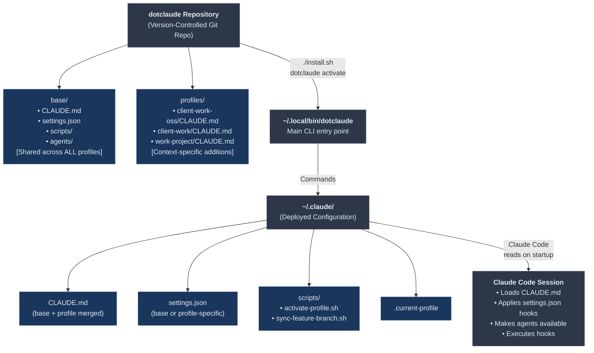
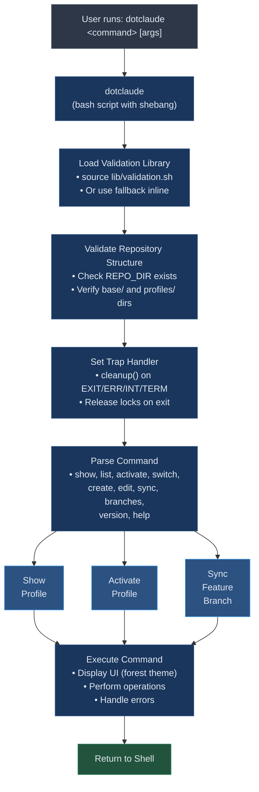
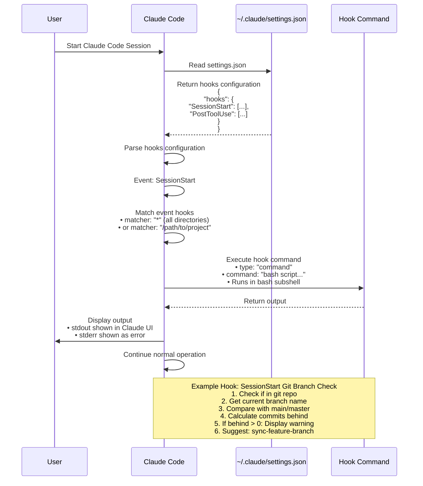
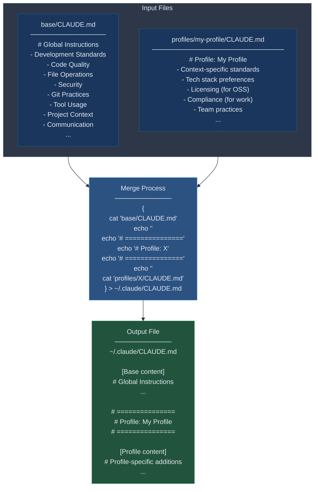
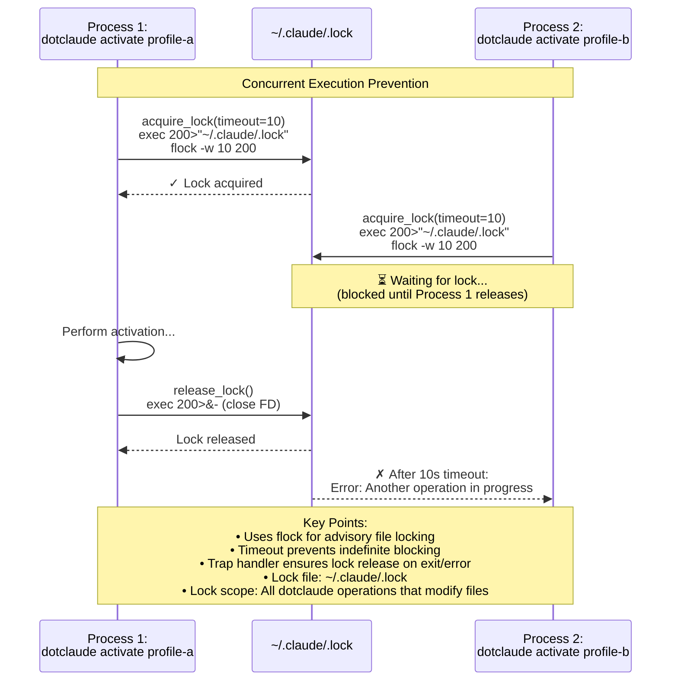
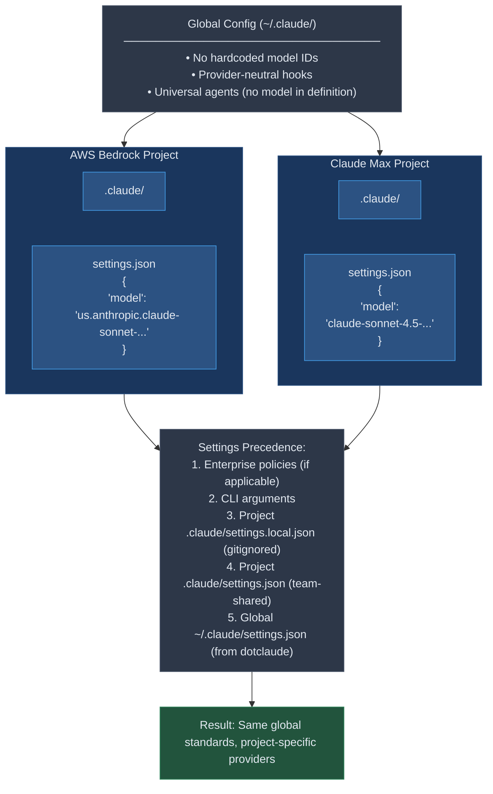

# dotclaude Architecture

Technical overview of how dotclaude works internally.

## System Architecture



## Profile Activation Flow

```mermaid
flowchart TD
    start["User runs: dotclaude activate my-profile"]

    step1["1. Validate Profile Name<br/>• Alphanumeric + hyphens only<br/>• No path traversal (.., /)"]
    step2["2. Acquire File Lock<br/>• ~/.claude/.lock<br/>• Timeout: 10 seconds<br/>• Prevents concurrent execution"]
    step3["3. Check Current Profile<br/>• Read ~/.claude/.current-profile<br/>• Skip backup if same profile"]
    step4["4. Backup Existing Config<br/>• CLAUDE.md → .backup.timestamp<br/>• settings.json → .backup...<br/>• chmod 600 (secure)<br/>• Keep only 5 recent backups"]
    step5["5. Merge CLAUDE.md<br/>base/CLAUDE.md<br/>+<br/>profiles/my-profile/CLAUDE.md<br/>↓<br/>~/.claude/CLAUDE.md"]
    step6["6. Apply Settings<br/>• Use profile settings.json if exists, else base<br/>• Copy to ~/.claude/"]
    step7["7. Mark Active Profile<br/>• Write profile name to<br/>~/.claude/.current-profile"]
    step8["8. Release Lock<br/>• Close file descriptor<br/>• Allow next operation"]
    complete["✓ Complete"]

    start --> step1 --> step2 --> step3 --> step4 --> step5 --> step6 --> step7 --> step8 --> complete

    style start fill:#2d3748,stroke:#4a5568,color:#e2e8f0
    style step1 fill:#1a365d,stroke:#2c5282,color:#e2e8f0
    style step2 fill:#1a365d,stroke:#2c5282,color:#e2e8f0
    style step3 fill:#1a365d,stroke:#2c5282,color:#e2e8f0
    style step4 fill:#1a365d,stroke:#2c5282,color:#e2e8f0
    style step5 fill:#1a365d,stroke:#2c5282,color:#e2e8f0
    style step6 fill:#1a365d,stroke:#2c5282,color:#e2e8f0
    style step7 fill:#1a365d,stroke:#2c5282,color:#e2e8f0
    style step8 fill:#1a365d,stroke:#2c5282,color:#e2e8f0
    style complete fill:#22543d,stroke:#2f855a,color:#e2e8f0
```



## CLI Command Flow



## Security Architecture

```mermaid
graph TB
    title["Security Layers"]

    subgraph layer1["Layer 1: Input Validation"]
        l1_func["validate_profile_name()"]
        l1_rules["• Regex: ^[a-zA-Z0-9_-]+$<br/>• No path traversal (.., /)<br/>• No special chars"]
    end

    subgraph layer2["Layer 2: Path Safety"]
        l2_func["validate_directory()"]
        l2_rules["• Check not symlink<br/>• Verify real directory<br/>• Prevent symlink attacks"]
    end

    subgraph layer3["Layer 3: Command Safety"]
        l3_func["Single-quoted heredocs"]
        l3_rules["• Prevent variable expansion<br/>• Use sed for replacement<br/>• No command injection"]
    end

    subgraph layer4["Layer 4: File Locking"]
        l4_func["acquire_lock()"]
        l4_rules["• flock with timeout<br/>• Prevent race conditions<br/>• Concurrent execution safe"]
    end

    subgraph layer5["Layer 5: Secure Permissions"]
        l5_func["Backup files: chmod 600"]
        l5_rules["• Only owner can read<br/>• Protect sensitive data<br/>• CLAUDE.md may have secrets"]
    end

    subgraph layer6["Layer 6: Safe Removal"]
        l6_func["safe_remove_directory()"]
        l6_rules["• Validate not symlink<br/>• Check canonical path<br/>• Must be in safe zones"]
    end

    title --> layer1 --> layer2 --> layer3 --> layer4 --> layer5 --> layer6

    style title fill:#2d3748,stroke:#4a5568,color:#e2e8f0
    style layer1 fill:#1a365d,stroke:#2c5282,color:#e2e8f0
    style layer2 fill:#1a365d,stroke:#2c5282,color:#e2e8f0
    style layer3 fill:#1a365d,stroke:#2c5282,color:#e2e8f0
    style layer4 fill:#1a365d,stroke:#2c5282,color:#e2e8f0
    style layer5 fill:#1a365d,stroke:#2c5282,color:#e2e8f0
    style layer6 fill:#1a365d,stroke:#2c5282,color:#e2e8f0
```



## Hook Execution Flow



## Data Flow: Profile Merge



## Installation Architecture

```mermaid
flowchart TD
    start["./install.sh"]

    flags["Parse Flags<br/>• --force<br/>• --non-interactive<br/>• --help"]
    tty["Check TTY (Interactive?)<br/>• if [ ! -t 0 ]; then<br/>    NON_INTERACTIVE=true"]
    dirs["Create Directories<br/>• ~/.claude/agents/<br/>• ~/.claude/scripts/<br/>• ~/.local/bin/"]
    cli["Install dotclaude CLI<br/>• Copy to ~/.local/bin/dotclaude<br/>• chmod +x<br/>• Check if ~/.local/bin in PATH"]
    scripts["Install Scripts<br/>• Copy base/scripts/* to<br/>  ~/.claude/scripts/<br/>• chmod +x *.sh"]
    agents["Install Agents<br/>• For each base/agents/*<br/>• Check if already exists<br/>• Validate not symlink<br/>• Prompt or auto-overwrite<br/>• Copy to ~/.claude/agents/"]
    select["Select Profile (if interactive)<br/>• List available profiles<br/>• Prompt user for selection<br/>• Or skip if non-interactive"]
    activate["Activate Selected Profile<br/>• bash activate-profile.sh &lt;name&gt;<br/>• Merges CLAUDE.md<br/>• Applies settings.json"]
    complete["✓ Complete"]

    start --> flags --> tty --> dirs --> cli --> scripts --> agents --> select --> activate --> complete

    style start fill:#2d3748,stroke:#4a5568,color:#e2e8f0
    style flags fill:#1a365d,stroke:#2c5282,color:#e2e8f0
    style tty fill:#1a365d,stroke:#2c5282,color:#e2e8f0
    style dirs fill:#1a365d,stroke:#2c5282,color:#e2e8f0
    style cli fill:#1a365d,stroke:#2c5282,color:#e2e8f0
    style scripts fill:#1a365d,stroke:#2c5282,color:#e2e8f0
    style agents fill:#1a365d,stroke:#2c5282,color:#e2e8f0
    style select fill:#1a365d,stroke:#2c5282,color:#e2e8f0
    style activate fill:#2c5282,stroke:#4299e1,color:#e2e8f0
    style complete fill:#22543d,stroke:#2f855a,color:#e2e8f0
```



## Component Responsibilities

### `dotclaude` (Main CLI)
- **Purpose**: Unified command-line interface
- **Responsibilities**:
  - Parse and dispatch commands
  - Load validation library
  - Validate repository structure
  - Handle trap cleanup
  - Display forest-themed UI
- **Key Functions**: `cmd_show()`, `cmd_list()`, `cmd_activate()`, `cmd_switch()`, `cmd_create()`, `cmd_edit()`

### `lib/validation.sh`
- **Purpose**: Centralized security validation
- **Responsibilities**:
  - Profile name validation
  - Directory safety checks
  - Symlink attack prevention
  - File locking
  - Disk space checks
  - Command verification
- **Key Functions**: `validate_profile_name()`, `validate_directory()`, `safe_remove_directory()`, `acquire_lock()`, `release_lock()`

### `activate-profile.sh`
- **Purpose**: Profile activation backend
- **Responsibilities**:
  - Acquire exclusive lock
  - Backup existing config
  - Merge CLAUDE.md files
  - Apply settings.json
  - Mark active profile
  - Release lock on exit
- **Called by**: `dotclaude activate`, `dotclaude switch`

### `sync-feature-branch.sh`
- **Purpose**: Git branch sync automation
- **Responsibilities**:
  - Check git repo status
  - Detect uncommitted changes
  - Calculate ahead/behind commits
  - Guide user through rebase/merge
  - Handle conflicts
  - Push changes safely
- **Called by**: `dotclaude sync`, sourced function `sync-feature-branch`

### `shell-functions.sh`
- **Purpose**: Shell convenience functions
- **Responsibilities**:
  - Provide wrapper functions
  - Git workflow helpers
  - Branch status checking
  - Post-PR workflows
- **Sourced by**: User's `~/.bashrc` or `~/.zshrc`

### `profile-management.sh`
- **Purpose**: Legacy profile management functions
- **Responsibilities**:
  - Profile activation wrapper
  - Show profile status
  - List available profiles
  - Quick profile switches
- **Sourced by**: User's `~/.bashrc` or `~/.zshrc` (optional)

## File System Layout

```
dotclaude/                              # Repository (version controlled)
├── README.md                           # Quick start guide
├── install.sh                          # Installer with flags
├── base/                               # Shared base configuration
│   ├── CLAUDE.md                      # Base development standards
│   ├── settings.json                  # Base hooks & settings
│   ├── scripts/
│   │   ├── dotclaude                  # Main CLI (deployed to ~/.local/bin)
│   │   ├── activate-profile.sh        # Profile activation
│   │   ├── sync-feature-branch.sh     # Git branch sync
│   │   ├── shell-functions.sh         # Shell helpers
│   │   ├── profile-management.sh      # Profile wrappers
│   │   └── lib/
│   │       └── validation.sh          # Security validation
│   └── agents/
│       └── best-in-class-gap-analysis/
│           └── definition.json
├── profiles/                           # Context-specific profiles
│   ├── my-project/
│   │   └── CLAUDE.md
│   ├── client-work/
│   │   └── CLAUDE.md
│   └── work-project/
│       └── CLAUDE.md
└── docs/
    ├── USAGE.md                        # Complete user guide
    └── ARCHITECTURE.md                 # This file

~/.local/bin/                           # User binaries (in PATH)
└── dotclaude                          # Main CLI (copy from base/scripts)

~/.claude/                              # Deployed configuration
├── .current-profile                   # Active profile name
├── .lock                              # Concurrent execution lock
├── CLAUDE.md                          # Merged: base + profile
├── CLAUDE.md.backup.*                 # Up to 5 recent backups
├── settings.json                      # Active settings
├── settings.json.backup.*             # Up to 5 recent backups
├── scripts/                           # Management scripts (copied)
│   ├── dotclaude
│   ├── activate-profile.sh
│   ├── sync-feature-branch.sh
│   ├── shell-functions.sh
│   ├── profile-management.sh
│   └── lib/
│       └── validation.sh
└── agents/                            # Shared agents (copied)
    └── best-in-class-gap-analysis/
        └── definition.json
```

## Concurrency Model



## Provider-Agnostic Design



---

**Back to:** [README.md](../README.md) | **See also:** [USAGE.md](USAGE.md)
