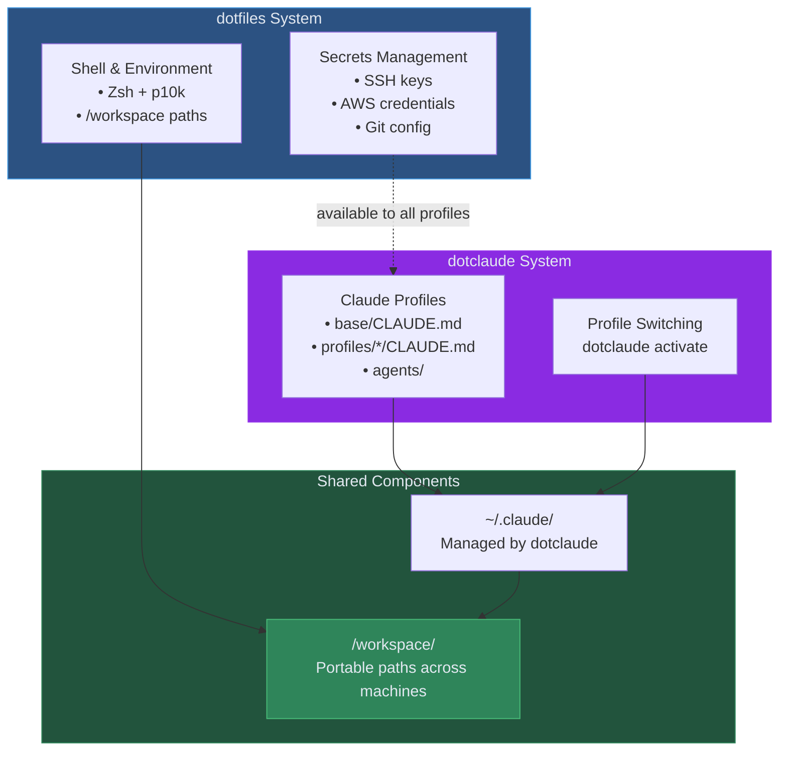

# dotfiles Integration Guide

## Overview

**dotclaude** and **[dotfiles](https://blackwell-systems.github.io/dotfiles/#/)** are complementary systems designed to work together seamlessly:

- **dotclaude**: Manages Claude Code profiles (CLAUDE.md, agents, settings)
- **dotfiles**: Manages secrets (SSH, AWS, Git), shell configuration, and cross-platform setup

Together, they provide a complete development environment that follows you across all your machines.

## Architecture



## Why Use Both?

### dotclaude Alone
- Switch between Claude profiles (OSS, work, client)
- Version control your Claude configuration
- Share profiles across machines via git

**Missing:**
- Manual secret management (SSH keys, AWS creds)
- Manual shell setup on each machine
- No `/workspace` path portability

### dotclaude + dotfiles
- All dotclaude benefits PLUS:
- Secrets automatically sync via vault (Bitwarden/1Password/pass)
- Shell configured identically everywhere
- `/workspace` paths work on all machines
- Complete environment follows you

## What Each System Manages

### dotclaude Handles:
- **Profile definitions**: base + profiles structure
- **CLAUDE.md files**: Instructions for Claude
- **Agents**: Custom Claude agents
- **settings.json**: Claude Code settings per profile
- **Profile switching**: `dotclaude activate <profile>`
- **~/.claude/ management**: Owns this directory

### dotfiles Handles:
- **Secrets**: SSH keys, AWS credentials, Git config, environment variables
- **Vault orchestration**: Multi-backend (Bitwarden, 1Password, pass)
- **Shell**: Zsh, Powerlevel10k, CLI tools (eza, fzf, bat, etc.)
- **Cross-platform**: Bootstrap scripts for macOS, Linux, WSL2
- **/workspace symlink**: Creates portable paths

### Shared Responsibilities:
- **~/workspace/**: Both systems use this canonical location
- **Portable sessions**: Both contribute to session portability
- **Machine setup**: Both participate in new machine bootstrap

## Setup

### Prerequisites

Install dotclaude first (if you haven't):

```bash
# Install dotclaude
curl -fsSL https://blackwell-systems.github.io/dotclaude/install.sh | bash

# Create your first profile
dotclaude init
dotclaude create my-profile
```

### Install dotfiles

```bash
# Interactive install (recommended)
curl -fsSL https://raw.githubusercontent.com/blackwell-systems/dotfiles/main/install.sh -o install.sh && bash install.sh --interactive

# Follow prompts to:
# - Choose vault backend (Bitwarden, 1Password, pass)
# - Set up /workspace symlink
# - Configure Claude Code integration
```

### Automatic Integration

dotfiles detects dotclaude automatically:

```bash
# During dotfiles bootstrap
Detected: dotclaude is installed
Skipping ~/.claude setup (managed by dotclaude)
Creating /workspace symlink for portable paths
Setting up vault for secrets management
```

No manual configuration needed - they coordinate automatically.

## Usage Workflows

### Workflow 1: Profile with Dedicated Secrets

**Scenario**: Freelancer with separate secrets per client

```bash
# Create client profile in dotclaude
dotclaude create client-acme
# Edit profiles/client-acme/CLAUDE.md with client-specific standards

# Store client secrets in dotfiles vault
cd ~/workspace/dotfiles
./vault/create-vault-item.sh
# Name: client-acme-ssh-key
# Type: secure-note
# Content: [paste SSH private key]

./vault/create-vault-item.sh
# Name: client-acme-aws-creds
# Content: [paste AWS credentials]

# Switch to client context
dotclaude activate client-acme
dotfiles vault restore "client-acme-*"

# Now: Claude uses client-acme profile, SSH uses client key, AWS uses client creds
cd /workspace/client-acme/project && claude
```

### Workflow 2: New Machine Setup

**Scenario**: Set up development environment on new laptop

```bash
# Step 1: Install dotfiles (handles shell, secrets, /workspace)
curl -fsSL https://raw.githubusercontent.com/blackwell-systems/dotfiles/main/install.sh -o install.sh && bash install.sh --interactive

# Step 2: Install dotclaude
curl -fsSL https://blackwell-systems.github.io/dotclaude/install.sh | bash

# Step 3: Clone your dotclaude profiles repository
cd ~/workspace
git clone git@github.com:yourname/dotclaude-profiles.git

# Step 4: Link dotclaude to your profiles
dotclaude config set profile_dir ~/workspace/dotclaude-profiles

# Step 5: Restore secrets from vault
dotfiles vault restore

# Step 6: Activate your preferred profile
dotclaude activate my-main-profile

# Done! Identical environment to other machines
```

### Workflow 3: Daily Context Switching

**Scenario**: Work on multiple projects throughout the day

```bash
# Morning: Personal open source
dotclaude activate oss-contrib
cd /workspace/oss/my-project && claude
# Claude context: OSS standards, permissive licensing
# Secrets: Personal SSH key, personal AWS

# Afternoon: Client project
dotclaude activate client-work
cd /workspace/client/api && claude
# Claude context: Client standards, compliance rules
# Secrets: Client SSH key, client AWS (if using separate secrets)

# Evening: Employer work
dotclaude activate work-employer
cd /workspace/work/platform && claude
# Claude context: Company standards, internal practices
# Secrets: Work SSH key, corporate AWS
```

### Workflow 4: Secrets Rotation

**Scenario**: Update SSH key across all machines

```bash
# On machine 1: Generate new key
ssh-keygen -t ed25519 -f ~/.ssh/id_ed25519_new

# Push to vault
dotfiles vault sync ssh

# On machine 2: Pull updated keys
dotfiles vault restore ssh

# On machine 3: Pull updated keys
dotfiles vault restore ssh

# All machines now have the new key
# dotclaude profiles automatically use it
```

## Configuration

### dotclaude Configuration

Your dotclaude profiles repository:

```
~/workspace/dotclaude-profiles/
├── base/
│   ├── CLAUDE.md            # Universal standards for all contexts
│   └── agents/              # Shared agents
├── profiles/
│   ├── oss-contrib/
│   │   └── CLAUDE.md        # OSS-specific additions
│   ├── client-acme/
│   │   ├── CLAUDE.md        # Client-specific standards
│   │   └── agents/          # Client-specific agents
│   └── work-employer/
│       └── CLAUDE.md        # Company standards
└── .dotclaude               # Repository metadata
```

### dotfiles Configuration

Located in `~/workspace/dotfiles/`:

```
~/workspace/dotfiles/
├── vault/
│   ├── restore-ssh.sh       # SSH key restoration
│   ├── restore-aws.sh       # AWS credential restoration
│   ├── restore-git.sh       # Git config restoration
│   └── backends/            # Vault backend implementations
├── zsh/
│   └── zshrc                # Shell config (respects dotclaude)
└── Brewfile                 # CLI tools for both systems
```

### Integration Points

The systems coordinate via:

1. **~/.claude/**: dotclaude manages, dotfiles respects
2. **~/workspace/**: Both use for portable paths
3. **/workspace symlink**: Created by dotfiles, used by dotclaude profiles
4. **Secrets**: dotfiles provides, dotclaude profiles can reference

## Advanced Integration

### Profile-Specific Secrets

You can tie secrets to specific profiles using naming conventions:

```bash
# In vault (via dotfiles):
oss-ssh-key              # Used when dotclaude profile is "oss-*"
client-acme-ssh-key      # Used when dotclaude profile is "client-acme"
work-ssh-key             # Used when dotclaude profile is "work-*"

# Restore secrets matching profile pattern:
dotclaude activate client-acme
dotfiles vault restore "client-acme-*"
```

### Profile in CLAUDE.md

Reference workspace paths in your CLAUDE.md:

```markdown
## Project Context

Project root: /workspace/client/acme-api

Tech stack:
- Node.js 20
- PostgreSQL (connection via ~/.aws/credentials profile: acme-prod)

Deployment:
- SSH to servers using key: ~/.ssh/id_ed25519_acme
```

dotfiles ensures these paths and secrets exist.

### Shell Integration

Both systems integrate with your shell:

```bash
# In ~/.zshrc (managed by dotfiles)
# dotclaude prompt integration
if command -v dotclaude &> /dev/null; then
  export DOTCLAUDE_PROFILE=$(dotclaude current 2>/dev/null || echo "none")
  # Prompt shows: [profile: client-acme] user@host:~/workspace/project
fi

# Workspace shortcuts
alias cws="cd /workspace"
alias ccode="cd /workspace/code"
```

### Environment Variables

Share environment between systems:

```bash
# In ~/.zshrc (managed by dotfiles)
export DOTCLAUDE_PROFILE_DIR="$HOME/workspace/dotclaude-profiles"
export DOTFILES_VAULT_BACKEND="bitwarden"

# Both systems can reference these
```

## Troubleshooting

### Issue: Secrets Not Available After Profile Switch

**Symptom**: Switched dotclaude profile but still using old SSH key

**Cause**: dotclaude manages Claude config, not secrets

**Solution**: Manually restore appropriate secrets:
```bash
dotclaude activate new-profile      # Changes Claude context only
dotfiles vault restore new-*        # Restore matching secrets
```

### Issue: Profile References Missing Secrets

**Symptom**: CLAUDE.md mentions AWS credentials but they don't exist

**Cause**: Secrets not yet stored in vault

**Solution**: Add secrets to vault:
```bash
dotfiles vault create               # Interactive creation
# Or manually create vault item in Bitwarden/1Password/pass

dotfiles vault restore              # Pull to local machine
```

### Issue: /workspace Paths Don't Work

**Symptom**: dotclaude profiles reference `/workspace/...` but symlink missing

**Solution**: Run dotfiles bootstrap:
```bash
cd ~/workspace/dotfiles
./bootstrap/bootstrap-dotfiles.sh
# Creates /workspace -> ~/workspace symlink
```

### Issue: Can't Switch Profiles

**Symptom**: `dotclaude activate` works but Claude doesn't see changes

**Cause**: Claude Code may need restart

**Solution**:
```bash
# Exit Claude Code
claude exit

# Reactivate profile
dotclaude activate my-profile

# Restart Claude
cd /workspace/project && claude
```

## Migration Guides

### From Standalone dotclaude

Already using dotclaude? Add dotfiles:

```bash
# Install dotfiles
curl -fsSL https://raw.githubusercontent.com/blackwell-systems/dotfiles/main/install.sh -o install.sh && bash install.sh --interactive

# dotfiles will detect dotclaude automatically
# Your ~/.claude/ profiles stay intact

# Add secret management
dotfiles vault sync --all           # Push current secrets to vault

# Now enjoy automated secret sync across machines
```

### From Manual Secret Management

Stop manually copying SSH keys:

```bash
# One-time: Push your secrets to vault
cd ~/workspace/dotfiles
./vault/create-vault-item.sh        # Add each secret

# On other machines: Restore from vault
dotfiles vault restore

# Future updates: Just sync
dotfiles vault sync ssh              # After rotating SSH key
```

## Best Practices

1. **Consistent naming**: Match profile names to secret prefixes
   ```bash
   # Profile: client-acme
   # Secrets: client-acme-ssh-key, client-acme-aws-creds
   ```

2. **Use /workspace paths**: Always reference `/workspace/...` in CLAUDE.md
   ```markdown
   Project located at /workspace/client/api
   ```

3. **Separate concerns**: Claude config in dotclaude, secrets in dotfiles
   ```bash
   # Don't put AWS keys in CLAUDE.md
   # Don't put coding standards in vault
   ```

4. **Version control both**:
   ```bash
   # dotclaude profiles repository
   cd ~/workspace/dotclaude-profiles && git push

   # dotfiles repository (optional, for custom scripts)
   cd ~/workspace/dotfiles && git push
   ```

5. **Document custom workflows**: Add notes to profile READMEs
   ```bash
   # In ~/workspace/dotclaude-profiles/profiles/client-acme/README.md
   # Prerequisites: Run `dotfiles vault restore client-acme-*` first
   ```

## Security Considerations

### Secrets Storage

- **dotfiles vault**: Encrypted in Bitwarden/1Password/pass
- **dotclaude profiles**: Version controlled, NO secrets
- **Never**: Store secrets in CLAUDE.md or .dotclaude files

### Safe to Share

dotclaude profiles can be public:
```bash
cd ~/workspace/dotclaude-profiles
git remote add origin git@github.com:user/dotclaude-profiles.git
git push
# Safe: No secrets, only Claude configuration
```

Secrets stay private in your vault.

### Machine-Specific Configuration

Some config is per-machine:

```bash
# dotfiles handles machine-specific via templates
dotfiles template init              # Set machine variables
dotfiles template render            # Generate machine-specific configs
```

## Complementary Strengths

### What dotclaude Does Best:
- Context switching (OSS vs work vs client)
- Claude-specific configuration
- Layered config inheritance (base + profiles)
- Quick profile switching

### What dotfiles Does Best:
- Secret management across machines
- Shell environment consistency
- Cross-platform bootstrap
- Tool installation (Homebrew, CLI tools)

### Together:
- **Complete environment** follows you everywhere
- **Secrets** sync automatically
- **Claude context** switches instantly
- **Paths** work identically on all machines

## Further Reading

- **[dotfiles Documentation](https://blackwell-systems.github.io/dotfiles/#/)** - Complete dotfiles guide
- **[dotfiles Integration Guide](https://blackwell-systems.github.io/dotfiles/#/DOTCLAUDE-INTEGRATION)** - Integration from dotfiles perspective
- **[dotfiles Vault System](https://blackwell-systems.github.io/dotfiles/#/vault-README)** - Multi-vault details
- **[dotclaude Usage Guide](USAGE.md)** - Complete dotclaude features

## Support

Issues with integration:
- **dotclaude**: https://github.com/blackwell-systems/dotclaude/issues
- **dotfiles**: https://github.com/blackwell-systems/dotfiles/issues
- **Integration**: Open issue in either repo, tag with `integration`
