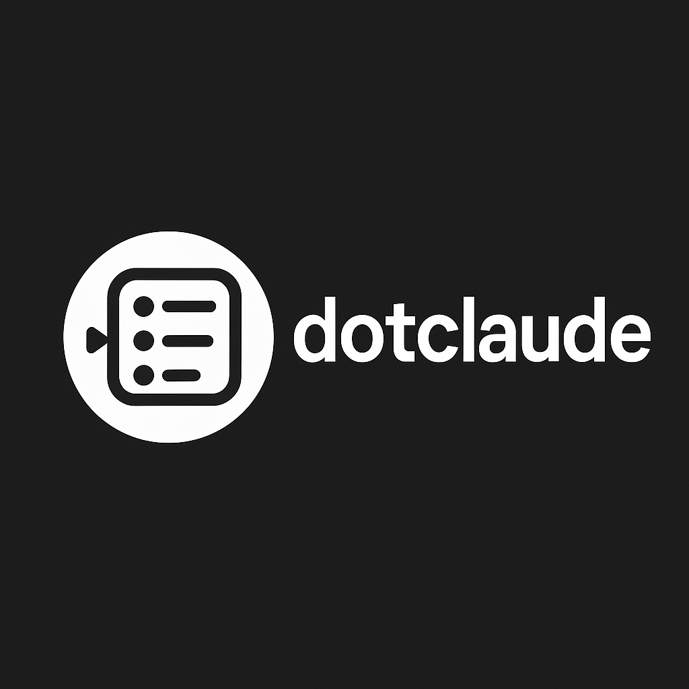

# dotclaude

> The _definitive_ profile management system for Claude Code

**macOS / Linux:**
curl -sSL https://raw.githubusercontent.com/blackwell-systems/dotclaude/main/install.sh | bash

**Windows (PowerShell):**
irm https://raw.githubusercontent.com/blackwell-systems/dotclaude/main/install.ps1 | iex

- **One-command switching** between work contexts
- **Layered configuration** - No duplication across profiles
- **Auto-detection** - Profiles activate automatically per-project
- **Git workflow tools** - Manage long-lived feature branches
- **Multi-provider** - AWS Bedrock + Claude Max support
- **Automatic backups** - Never lose your configuration
- **Cross-platform** - Linux, macOS, and Windows
- **Version controlled** - Sync profiles across all your machines

[Get Started](https://github.com/blackwell-systems/dotclaude#readme)
[View on GitHub](https://github.com/blackwell-systems/dotclaude)
